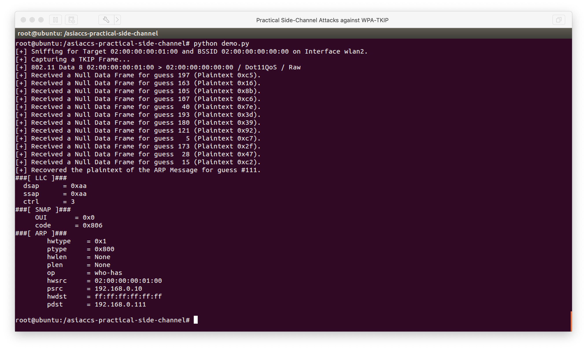

# Practical Side-Channel Attacks against WPA-TKIP
Supporting code for the ACM ASIA Conference on Computer and Communications Security (ACM ASIACCS) 2019 paper "Practical Side-Channel Attacks against WPA-TKIP" by Domien Schepers, Aanjhan Ranganathan, and Mathy Vanhoef. 

Paper available at http://papers.mathyvanhoef.com/asiaccs2019.pdf.

## Abstract
We measure the usage of cipher suites in protected Wi-Fi networks, and do this for several distinct geographic areas. Surprisingly, we found that 44.81% of protected networks still support the old WPA-TKIP cipher. Motivated by this, we systematically analyze the security of several implementations of WPA-TKIP, and present novel side-channel attacks against them. The presented attacks bypass existing countermeasures and recover the Michael message authentication key in 1 to 4 minutes. Using this key, an adversary can then decrypt and inject network traffic. In contrast, previous attacks needed 7 to 8 minutes. These results stress the urgent need to stop using WPA-TKIP.

## BibTeX
```
@inproceedings{schepers2019practical,
  title={Practical Side-Channel Attacks against {WPA-TKIP}},
  author={Schepers, Domien and Ranganathan, Aanjhan and Vanhoef, Mathy},
  booktitle={Proceedings of the 2019 ACM on Asia Conference on Computer and Communications Security},
  year={2019},
  organization={ACM}
}
```

## Results
Detailed information on the results can be found on the following resources.

Paper AsiaCCS 2019:
- http://papers.mathyvanhoef.com/asiaccs2019.pdf

Presentation Black Hat Europe 2019:
- https://i.blackhat.com/eu-19/Thursday/eu-19-Schepers-Practical-Side-Channel-Attacks-Against-WPA-TKIP-2.pdf

## Code
First, install the following dependencies:
```
apt install python-scapy
```

Next, set up the simulated radio interfaces:
```
modprobe mac80211_hwsim radios=3
iwconfig wlan2 mode monitor
ifconfig wlan1 up
ifconfig wlan2 up
ip addr add 192.168.0.10 dev wlan1
```

Hopstapd and wpa_supplicant can be started as follows:
```
hostapd configurations/hostapd.conf
wpa_supplicant -i wlan1 -c configurations/wpa_supplicant.conf
```

Note that ARP traffic can be forced using the following command:
```
arping -Iwlan1 192.168.0.111 -c1
```

Finally, run the demo:
```
python demo.py
```

<p align="center">
  
</p>
